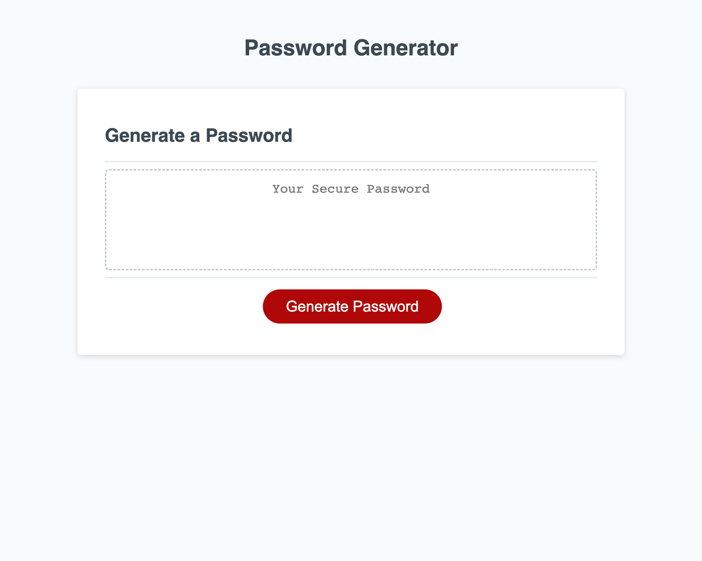
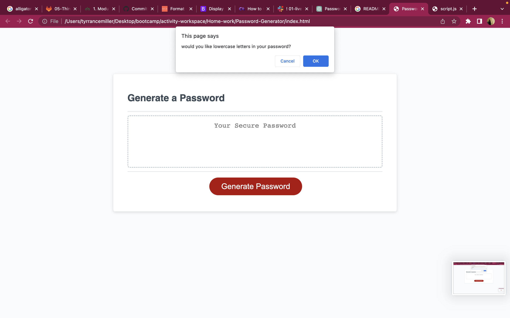
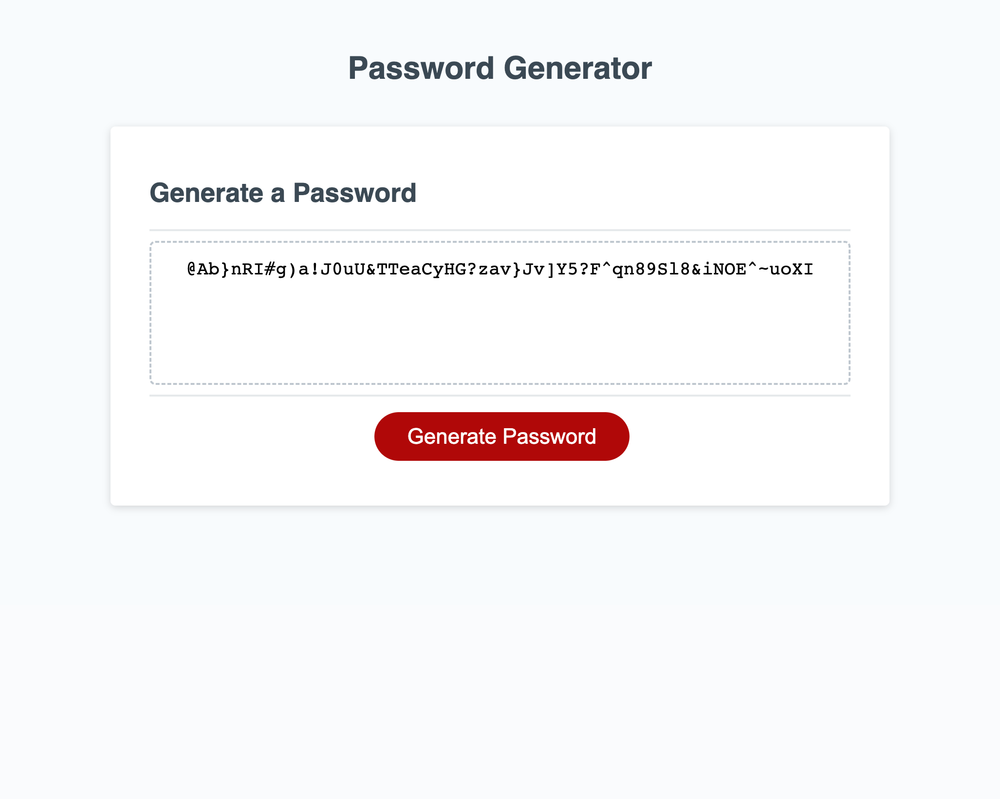

# Password-Generator

## Description

The purpose of this project was to create an updated password generator web application that is responsive and presents prompts for the user to choose the amount of characters as long as the ammount of characters used are 8 but no mre than 128.

## Usage 

- When the application is open the user is presented with the option the create a password by clicking the read button.

 - Once the button is clicked the user is given a prompt at the top of the page where they will enter the number of characters and the type of characters that will be used to generate the passowrd.
 

  - Once all of the prompts are answered the user will be given a generated password consistent with there request from the prompt.
  

  https://t-hash-ux.github.io/Password-Generator/

## Credits

- Matthew Lomard
- Sarah Miller
- Chrisopher Snyder

## License 
MIT License

